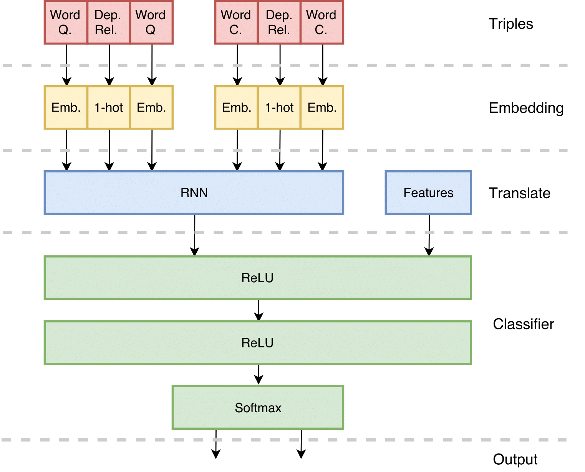
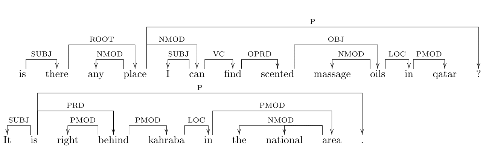

## Authors
- [Antonio Carta](https://github.com/AntonioCarta)
- [Federico Errica](https://github.com/diningphil)
- [Andrea Madotto](https://github.com/andreamad8)
- [Ludovica Pannitto](https://github.com/ellepannitto)

## About
The proposed model makes use of a dependency parser to generate pair of words with their dependency relation. 
Then each word is converted to a vector using word embeddings, and each dependency relation to a 1-hot-encoding vector. Thus a triple 
`(e_0,rel, e_1)` is created, where `e_0` and `e_1` are the word-embeddings for the 2 words, and `rel` is the encoding of the dependency relation.

Therefore, the input of our model is dual: a sequence of triples which represents the question and another sequence for the comment. These are then passed to a sentence encoder, which is a Recurrent Neural Network (RNN), that is used to return a single output aiming to represent the entire sequence. 
The RNN output of both questions and comments, along with a vector made up of additional features, are the inputs of the final feed-forward layers that perform the classification.

The following figure shows an outline of the model:

Dependency parsing of two sentences taken from a question and a comment in the training set. In this example the first input `x(t)` of the RNN is going to be: `("is", SUBJ,"there","is", SUBJ,"It")`.

